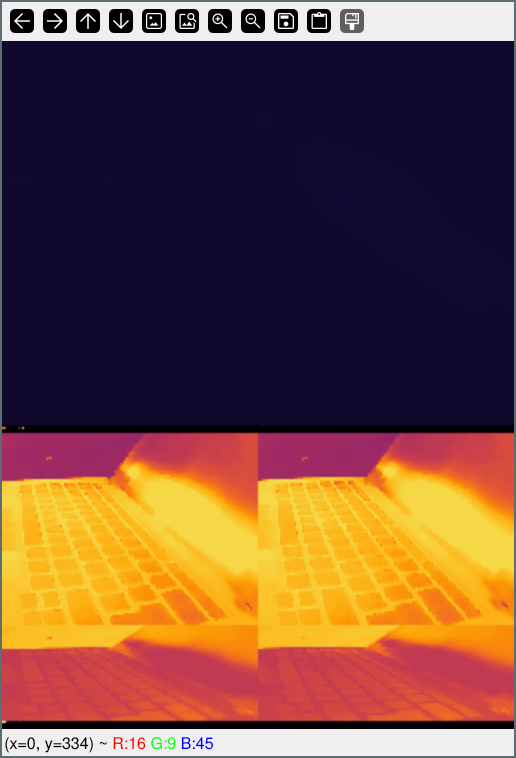

# IR View Suite

**WORK IN PROGRESS**

## Components

### IR View

TODO: Main application

### ircap

TODO: Server

### Other Utilities

The following global constants are defined in these utilities and control parameters such as resolution, frames per second and video device selection. Since camera characteristics vary between models, your mileage may vary:

- `WIDTH`: width of raw frame, in pixels
- `HEIGHT`: height of raw frame, in pixels
- `FRAME`: total frame size in bytes, derived from `WIDTH`, `HEIGHT`, and the number of bytes per pixel
- `MAX_FPS`: theoretical maximum frame rate of the camera
- `DEVICE`: path to the video device (usually `/dev/video*`)

#### irwebcam

Opens a camera stream via OpenCV viewer. Video is presented as received from the raw byte stream of the video device, with a color palette applied.

Since IR cameras typically provide relatively low-resolution images, the display can be enlarged using the `FACTOR` variable. When `ROI` is set to `True`, only a selected portion of the frame is displayed. The default region of interest targets the thermal image produced by the Hikmicro Mini2 camera, the device for which this utility was originally developed.

#### irshot

## Dependencies

- `opencv-python`
- `scipy`
- `numpy`
- `matplotlib`
- `PyQt5`
