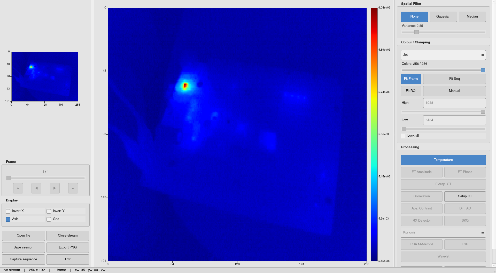

# IR View Suite

## Overview

IR View is an infrared thermography viewer and processor for non-destructive testing, built with a strong focus on compatibility with MATLAB data sets. Its associated utilities include a video streaming server, a live preview program in the style of a webcam, and a headless capturing script which produces MATLAB-compatible `.mat` files.

## Origin

This software suite began as a Python port of IR View 1.7.5, originally written in MATLAB by _Mariacristina Pilla_, _Matthieu Klein_ and _Xavier Maldague_ (1999–2008). The port was carried out during my stay at the _Grupo de Ingeniería Fotónica, Universidad de Cantabria_ (March through June of 2026). Soon, the port expanded far beyond the scope of the original application, and standalone utilities were written to aid in development.

## Components

### IR View



IR View is the main application of the suite. It provides real-time visualization and processing of infrared thermal data acquired either directly from a local video device or remotely through an ircap TCP stream.

IR View supports two acquisition modes:

Local mode: direct access to `/dev/video*` devices using `v4l2-ctl` stream capture.
Network mode: connection to a remote (or localhost) ircap server, receiving framed thermal data over TCP with a lightweight binary protocol.

Each incoming frame is decomposed into predefined regions corresponding to sensor layout (thermal image and metadata channels). These regions are exposed internally as structured arrays for downstream processing.

A processing pipeline operates on the incoming data stream, applying filtering and normalization stages before display. Common operations include temporal smoothing, spatial filtering, and algorithmic processing.

Internally, IR View is designed as a modular system where acquisition, processing and rendering are decoupled. This allows the same processing backend to operate on both live streams and recorded datasets without modification.

The application accepts tweaking through the global configuration file, ensuring consistent parameters across acquisition, streaming and visualization components.

IR View acts as the central execution layer of the suite: all other utilities (ircap, irshot, irwebcam) either feed data into it or replicate subsets of its pipeline for debugging and acquisition tasks.

### ircap

TCP server that streams raw camera frames to any connected client. It runs in the background and forwards frames acquired from the video device over a TCP socket.

IR View includes a client mode capable of connecting to an ircap stream, allowing real-time visualization of remotely served thermal data.

The server is multi-threaded, enabling concurrent connections from multiple clients. Each client receives an independent stream derived from the same camera source on the host machine, allowing simultaneous remote viewing without interfering with acquisition.

Running ircap every time it is needed can get old quickly. It is recommended to create a simple service. A very basic systemd service `ircap.service` would be mocked up as follows:

```ini
[Unit]
Description=IR Camera TCP Stream Server
After=network.target

[Service]
Type=simple
ExecStart=ircap
Restart=always
RestartSec=1
User=irview

[Install]
WantedBy=multi-user.target
```

Substitute irview at `User=irview` for your actual user name so as to not run ircap as root. If that does not bother you, you may omit the line entirely.

### Other Utilities

#### irwebcam

Opens a camera stream via OpenCV viewer. Video is presented as received from the raw byte stream of the video device, with a color palette applied.

Since IR cameras typically provide relatively low-resolution images, the display can be enlarged using the `FACTOR` variable. When `ROI` is set to `True`, only a selected portion of the frame is displayed. The default region of interest targets the thermal image produced by the Hikmicro Mini2 camera, the device for which this utility was originally developed.

#### irshot

```sh
irshot [n_samples] [fps]
```

Captures a sequence of thermal frames from the camera and exports them to a MATLAB-compatible `.mat` (version 5) file.

The first command-line argument specifies the number of frames to acquire, while the second specifies the desired sampling rate in frames per second. Since the camera operates at a fixed maximum frame rate, lower sampling rates are achieved by discarding intermediate frames. Thus, best consistency for delta time between frames is achieved by choosing a sampling rate that is easily divisible by your `MAX_FPS`.

Captured data are stored in a `.mat` file whose name includes the acquisition timestamp, number of samples, and sampling rate. The file contains the following arrays extracted from the raw camera stream:

- `TopImg`
- `MidLeftImg`
- `MidRightImg`
- `BottLeftImg`
- `BottRightImg`
- `Meta1`
- `Meta2`

These regions correspond to the different image and metadata areas present in the raw frame layout produced by the Hikvision Mini2 camera.

In addition to the image data, the output file stores a scalar variable named `frames_sec`, containing the sampling rate used during acquisition. This value is intended as input for IR View algorithms with an explicit dependence on the temporal spacing between samples (`Δt`).

## Dependencies

- `opencv-python`
- `scipy`
- `numpy`
- `matplotlib`
- `PyQt5`

## Installation

#### Build
```sh
make
```

#### Install
```sh
sudo make install
```

## Configuration

IR View Suite relies on a global configuration file to define camera parameters, acquisition settings and calibration data shared across all utilities. This avoids per-script hardcoding and ensures consistent behavior across the suite. This repository has an example configuration file `config.ini` which is installed at `/etc/irview.ini` by default.

#### Camera

| Key | Type | Description |
|-----|------|-------------|
| device | string | Path to video device |
| width | int | Frame width in pixels |
| height | int | Frame height in pixels |
| max_fps | int | Maximum camera frame rate |

#### Calibration

Keys `c0` through `c4` define a 4th-degree calibration polynomial relating raw sensor values to degrees Celsius.

#### Network

Key `port` defines the TCP port used by the streaming server.
